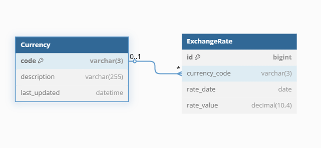
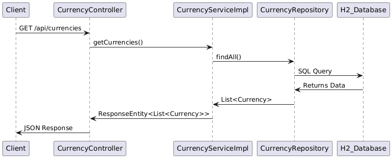
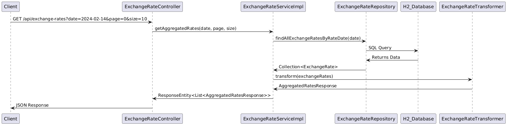
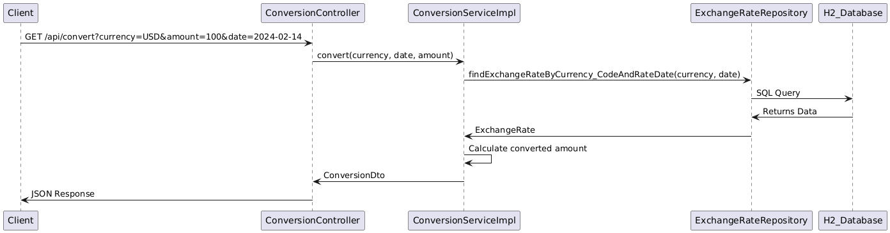

# Foreign Exchange Rate Service Documentation

## Table of Contents
- [Architecture](#architecture)
- [Database Schema](#database-schema)
- [API Endpoints](#api-endpoints)
- [Testing](#testing)
- [Improvements](#improvements)

## Architecture
This project follows a **layered architecture**:
1. **Controller Layer** - Handles API requests.
2. **Service Layer** - Implements business logic.
3. **Repository Layer** - Interacts with the database.
4. **Model & DTO Layer** - Defines entities and API response structures.

## Database Schema
The database consists of two tables:

1. **`Currency` Table**
    - `code`: Primary Key (ISO 4217 currency code, e.g., "USD").
    - `description`: Descriptive name of the currency.
    - `last_updated`: Timestamp of the last update.

2. **`ExchangeRate` Table**
    - `id`: Primary Key (auto-incremented).
    - `currency_code`: Foreign Key referencing `Currency(code)`.
    - `rate_date`: Date when the exchange rate was recorded.
    - `rate_value`: The exchange rate value.

### ER Diagram


## API Endpoints

### 1. Get All Currencies
**Endpoint:**  
`GET /api/currencies`

**Response:**
```json
[
   {
      "code": "AUD",
      "description": "Australia"
   },
   {
      "code": "BGN",
      "description": "Bulgaria"
   }
]
```
📌 **Sequence Diagram:**  


### 2. Get Exchange Rates
**Endpoint:**  
`GET /api/exchange-rates?date=2024-02-14&page=0&size=10`

**Response:**
```json
[
   {
      "date": "2024-02-14",
      "rates": {
         "CHF": 0.949300,
         "MXN": 18.355900,
         "ZAR": 20.398200,
         "INR": 88.956000,
         "USD": 1.071300
      }
   }
]
```
📌 **Sequence Diagram:**  


### 3. Convert Currency
**Endpoint:**  
`GET /api/convert?currency=USD&amount=100&date=2024-02-14`

**Response:**
```json
{
   "currency": "USD",
   "date": "2024-02-01",
   "originalAmount": 100,
   "exchangeRate": 1.081400,
   "convertedAmount": 92.47
}
```
📌 **Sequence Diagram:**  


## Testing
Unit tests are included using **JUnit & Mockito**.

### Run Tests
```sh
mvn test
```


## Improvements
Potential enhancements for production:

✅ **Use PostgreSQL** instead of H2 for better scalability.  
✅ **Improve Test Coverage** by adding more unit and integration tests, covering edge cases and API failure scenarios.  
✅ **Improve error handling** with a more detailed response structure.

## Conclusion
This documentation provides an overview of the system architecture, database schema, API endpoints, and testing setup. The diagrams help visualize how components interact, making it easier to understand and extend the project.  
