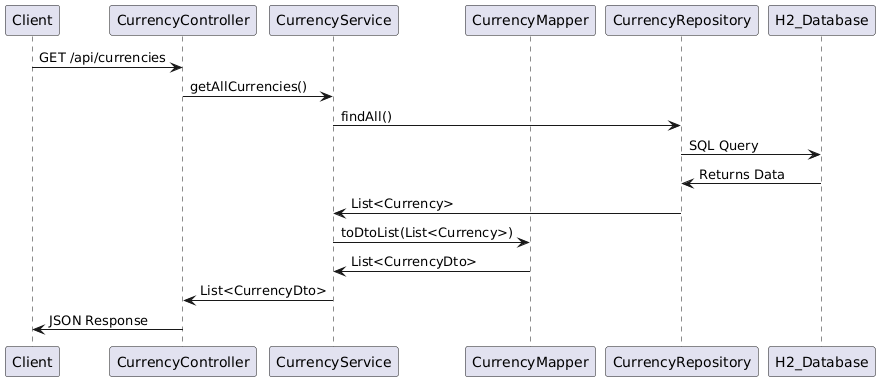
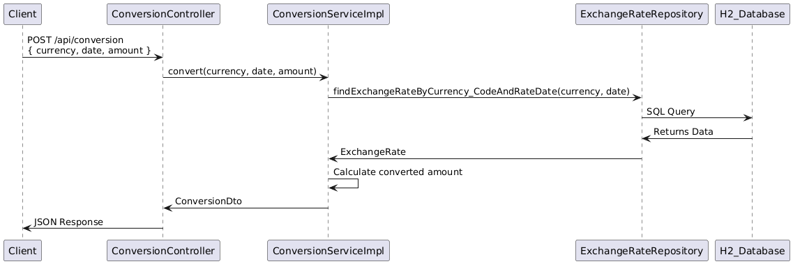

# Foreign Exchange Rate Service Documentation

## Overview
This project is a Foreign Exchange Rate Service built with Java Spring Boot. It provides exchange rates, currency details, and a conversion API. The system fetches real-time exchange rates from the Bundesbank API, caches them for optimization, and allows users to convert between currencies.

## Table of Contents
- [Architecture](#architecture)
- [Database Schema](#database-schema)
- [API Endpoints](#api-endpoints)
- [Testing](#testing)
- [Improvements](#improvements)


## Architecture
This project follows a **modular architecture**, where functionalities are grouped by domain rather than by strict technical layers. This modular approach improves **scalability, maintainability, and reduces dependencies** between different parts of the system. Each module contains its own controller, service, repository, model, and exception handling.

### **Modules Overview:**
1. **Currency Module** - Manages currency-related operations, including fetching available currencies.
   - Contains: `CurrencyController`, `CurrencyService`, `CurrencyRepository`, `Currency`

2. **Exchange Rate Module** - Handles exchange rate retrieval, transformation, and caching.
   - Contains: `ExchangeRateController`, `ExchangeRateService`, `ExchangeRateRepository`, `ExchangeRate`
   - Uses: `CurrencyRepository` to fetch related currency details.

3. **Conversion Module** - Provides functionality for currency conversion.
   - Contains: `ConversionController`, `ConversionService`, `ConversionRepository`, `Conversion`
   - Uses: `ExchangeRateRepository` to directly retrieve exchange rate data.

This design ensures **low coupling** between modules while keeping related functionalities together, making it easy to extend and modify specific areas without affecting the entire system.

### Architecture Diagram


## Database Schema
The database consists of two tables:

1. **`Currency` Table**
    - `code`: Primary Key (ISO 4217 currency code, e.g., "USD").
    - `description`: Descriptive name of the currency.
    - `last_updated`: Timestamp of the last update.

2. **`ExchangeRate` Table**
    - `id`: Primary Key (auto-incremented).
    - `currency_code`: Foreign Key referencing `Currency(code)`.
    - `rate_date`: Date when the exchange rate was recorded.
    - `rate_value`: The exchange rate value.

### ER Diagram


## API Endpoints

### 1. Get All Currencies
**Endpoint:**  
`GET /api/currencies`

**Response:**
```json
[
   {
      "code": "AUD",
      "description": "Australia"
   },
   {
      "code": "BGN",
      "description": "Bulgaria"
   }
]
```
📌 **Sequence Diagram:**  


### 2. Get Exchange Rates
**Endpoint:**  
`GET /api/exchange-rates?date=2024-02-14&page=0&size=10`

**Response:**
```json
[
   {
      "date": "2024-02-14",
      "rates": {
         "CHF": 0.949300,
         "MXN": 18.355900,
         "ZAR": 20.398200,
         "INR": 88.956000,
         "USD": 1.071300
      }
   }
]
```
📌 **Sequence Diagram:**  


### 3. Convert Currency
**Endpoint:**  
`POST /api/conversion`

**Request**
```json 
{
  "amount": 100,
  "currency": "USD",
  "date": "2025-02-14"
}
```
**Response:**
```json
{
   "currency": "USD",
   "date": "2024-02-01",
   "originalAmount": 100,
   "exchangeRate": 1.081400,
   "convertedAmount": 92.47
}
```
📌 **Sequence Diagram:**  


## Data Loading and External API Calls
- **DataLoader**: Used in development to load currency and exchange rate data from CSV files.
- **Bundesbank API Client**: Calls the German Bundesbank API to fetch live exchange rates and stores them in the database.

## Scheduled Tasks and Cron Jobs
- To ensure exchange rates are always up-to-date, a **cron job** runs daily to fetch the latest rates from the Bundesbank API.
- The cron job is implemented using Spring's `@Scheduled` annotation.
- This cron job runs **every day at 23:59** to fetch and update exchange rates.


## Exception Handling
A centralized exception handling system is implemented using `@ControllerAdvice`. It ensures consistent error handling across all modules.

## Logging and Performance Monitoring
A logging interceptor is in place to log incoming requests and execution times. This helps in identifying slow endpoints and debugging issues.

## API Documentation
Swagger is integrated to provide API documentation, making it easy for developers to test endpoints and understand request formats.

## Design Patterns Used
1. **Singleton** → Used in Spring-managed beans like services and repositories.
2. **Repository Pattern** → Encapsulates database queries and abstracts persistence logic.
3**Interceptor Pattern** → Implemented in `RequestLoggingInterceptor` to log requests and responses.

## SOLID Principles Applied
1. **Single Responsibility Principle (SRP)** → Each class has one reason to change (e.g., controllers only handle API logic, services handle business logic).
2. **Open/Closed Principle (OCP)** → The system allows new currency providers without modifying core logic.
3. **Liskov Substitution Principle (LSP)** → Any subclass can be used in place of its parent class without breaking functionality.
4. **Interface Segregation Principle (ISP)** → Services are divided based on functionality, avoiding bloated interfaces.
5. **Dependency Inversion Principle (DIP)** → High-level modules (`ExchangeRateService`) depend on abstractions (`BundesbankApiClient`), not concrete implementations.

## Dependency Injection and Inversion of Control
- **Dependency Injection (DI)** is used in the project via Spring's `@Autowired` and constructor-based injection to provide dependencies at runtime.
- **Inversion of Control (IoC)** ensures that the flow of control is managed by the Spring Framework rather than manually instantiating objects.
- **Example:**
   - `ExchangeRateServiceImpl` depends on `BundesbankApiClient`, but it does not instantiate it directly. Instead, Spring provides the required implementation at runtime.
   - This makes the code more flexible, testable, and scalable by allowing the injection of different implementations if needed.


## Testing
Unit tests are included using **JUnit & Mockito**.

### Run Tests
```sh
mvn test
```


## Improvements
Potential enhancements for production:

✅ **Use PostgreSQL** instead of H2 for better scalability.  
✅ **Improve Test Coverage** by adding more unit and integration tests, covering edge cases and API failure scenarios.  
✅ **Improve error handling** with a more detailed response structure.

## Conclusion
This documentation provides an overview of the system architecture, database schema, API endpoints, and testing setup. The diagrams help visualize how components interact, making it easier to understand and extend the project.  
